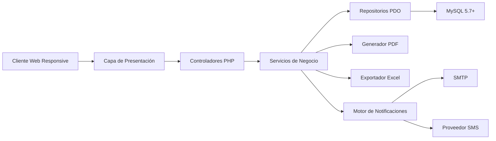
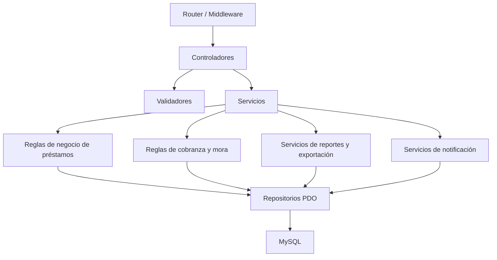
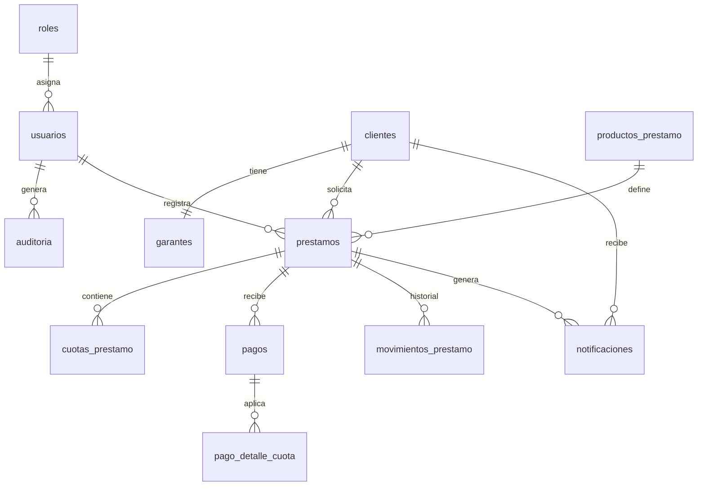

## 1. Diseño de Arquitectura


Arquitectura propuesta de tipo monolito modular en PHP sobre XAMPP, separada por capas para mantener compatibilidad con PHP 7.4+, facilitar mantenimiento y reducir complejidad operativa. La interfaz usa Bootstrap para la maquetación responsiva y JavaScript con `fetch` para interacciones dinámicas, cálculos y filtros sin recargas innecesarias.

## 2. Descripción Tecnológica
- Frontend: HTML5, Bootstrap 5, Bootstrap Icons, JavaScript ES6, `fetch`, Chart.js.
- Backend: PHP 7.4+ con estructura MVC ligera, enrutador frontal, controladores, servicios, repositorios PDO, validadores y helpers de seguridad.
- Base de datos: MySQL 5.7+ en XAMPP, tablas normalizadas, vistas de apoyo, índices compuestos y procedimientos almacenados.
- Exportación: Dompdf para comprobantes y reportes PDF, PhpSpreadsheet para exportación Excel.
- Notificaciones: PHPMailer para correo y adaptador SMS configurable para Twilio o gateway local.
- Seguridad: contraseñas con `password_hash`, sesiones seguras, tokens CSRF, validación server-side, sanitización de salida y consultas preparadas PDO.
- Tareas automáticas: scripts PHP ejecutables por cron o Programador de tareas de Windows para recordatorios y actualización de mora.

## 3. Definición de Rutas
| Ruta | Propósito |
|------|-----------|
| `/` | Redirección a inicio de sesión o dashboard según sesión activa |
| `/login` | Autenticación de usuarios |
| `/logout` | Cierre seguro de sesión |
| `/dashboard` | KPIs, gráficos, alertas y accesos rápidos |
| `/clientes` | Listado y filtros de clientes |
| `/clientes/crear` | Alta de cliente y garante |
| `/clientes/editar/{id}` | Edición de expediente de cliente |
| `/clientes/ver/{id}` | Consulta integral del cliente |
| `/prestamos` | Listado y filtros de préstamos |
| `/prestamos/crear` | Registro de nuevo préstamo con simulación |
| `/prestamos/ver/{id}` | Detalle, cronograma, pagos e historial del préstamo |
| `/prestamos/{id}/pdf` | Generación de contrato o comprobante PDF |
| `/cobros` | Registro de pagos y caja de cobranza |
| `/reportes` | Reportes y exportaciones |
| `/usuarios` | Administración de usuarios y roles |
| `/configuracion` | Parámetros generales del negocio |
| `/api/clientes/buscar` | Búsqueda AJAX de clientes |
| `/api/prestamos/simular` | Cálculo automático de cuotas y calendario |
| `/api/prestamos/{id}/mora` | Recalcula mora y saldo actualizado |
| `/api/cobros/registrar` | Registra pago, actualiza cuotas y genera movimiento |
| `/api/notificaciones/pendientes` | Consulta alertas y recordatorios pendientes |

## 4. Definiciones de API
Las vistas server-rendered convivirán con endpoints JSON internos para mejorar usabilidad en tablas, formularios dinámicos, simuladores de cuotas y paneles de alertas.

### 4.1 Tipos de Datos Principales
```php
<?php
/**
 * Estructura de respuesta estándar.
 */
[
    'ok' => true,
    'message' => 'Operación realizada correctamente',
    'data' => [],
    'errors' => []
];
```

```php
<?php
$clientePayload = [
    'foto' => 'clientes/uuid.jpg',
    'nombres' => 'Juan Carlos Perez Lopez',
    'dni' => '12345678',
    'telefono' => '999111222',
    'email' => 'cliente@correo.com',
    'direccion' => 'Av. Principal 123',
    'nacionalidad' => 'Peruana',
    'tipo_vivienda' => 'Propia',
    'situacion_laboral' => 'Dependiente',
    'estado_civil' => 'Casado',
    'direccion_trabajo' => 'Zona Industrial 45',
    'garante' => [
        'foto' => 'garantes/uuid.jpg',
        'nombre_completo' => 'Maria Flores Ruiz',
        'dni' => '87654321',
        'telefono' => '988777666',
        'direccion' => 'Jr. Secundario 456'
    ]
];
```

```php
<?php
$prestamoPayload = [
    'cliente_id' => 10,
    'producto_id' => 2,
    'monto_principal' => 5000.00,
    'tasa_interes_tipo' => 'mensual',
    'tasa_interes_valor' => 12.50,
    'tasa_mora_diaria' => 0.80,
    'fecha_otorgamiento' => '2026-07-22',
    'fecha_primer_pago' => '2026-08-22',
    'plazo_cuotas' => 6,
    'frecuencia_pago' => 'mensual',
    'monto_cuota' => 958.33
];
```

### 4.2 Endpoints Clave
| Método | Endpoint | Uso |
|--------|----------|-----|
| `POST` | `/api/auth/login` | Valida credenciales y crea sesión |
| `GET` | `/api/clientes/buscar?q=` | Busca clientes activos para formularios |
| `POST` | `/api/clientes` | Crea cliente y garante con validaciones |
| `PUT` | `/api/clientes/{id}` | Actualiza expediente del cliente |
| `POST` | `/api/prestamos/simular` | Devuelve cuota, interés total y cronograma proyectado |
| `POST` | `/api/prestamos` | Registra préstamo si el cliente no tiene deuda bloqueante |
| `GET` | `/api/prestamos/{id}` | Consulta resumen financiero, cuotas y movimientos |
| `POST` | `/api/cobros/registrar` | Registra pago, distribuye capital/interés/mora y genera comprobante |
| `GET` | `/api/reportes/cartera` | Obtiene cartera filtrada para dashboard y exportaciones |
| `POST` | `/api/notificaciones/ejecutar` | Dispara recordatorios y alertas pendientes |

## 5. Diagrama de Arquitectura del Servidor


### Estructura Modular Recomendada
- `public/`: punto de entrada, recursos públicos y archivos subidos controlados.
- `app/Controllers/`: controladores HTTP y JSON.
- `app/Services/`: lógica de negocio de clientes, préstamos, pagos, reportes y alertas.
- `app/Repositories/`: acceso a datos con PDO y consultas preparadas.
- `app/Models/`: entidades y mapeos ligeros.
- `app/Validators/`: validaciones de formularios y reglas consistentes.
- `app/Helpers/`: utilidades de seguridad, fechas, dinero, PDF y exportación.
- `config/`: conexión, rutas, permisos, correo, SMS y parámetros del sistema.
- `database/`: archivo SQL maestro, migraciones opcionales, procedimientos almacenados y semillas.

## 6. Modelo de Datos
### 6.1 Definición del Modelo


### 6.2 Entidades Principales
| Tabla | Propósito |
|-------|-----------|
| `roles` | Catálogo de roles del sistema |
| `usuarios` | Operadores autenticados y su estado |
| `clientes` | Expediente completo del cliente |
| `garantes` | Información del garante por cliente |
| `productos_prestamo` | Parámetros reutilizables para tipos de crédito |
| `prestamos` | Encabezado del crédito otorgado |
| `cuotas_prestamo` | Calendario, capital, interés, mora y estado por cuota |
| `pagos` | Encabezado de cada cobro realizado |
| `pago_detalle_cuota` | Distribución del pago por cuota |
| `movimientos_prestamo` | Historial operativo y financiero del crédito |
| `notificaciones` | Cola de recordatorios y alertas |
| `auditoria` | Trazabilidad de acciones sensibles del sistema |

### 6.3 Lenguaje de Definición de Datos Base
```sql
CREATE TABLE roles (
    id TINYINT UNSIGNED AUTO_INCREMENT PRIMARY KEY,
    nombre VARCHAR(50) NOT NULL UNIQUE,
    descripcion VARCHAR(150) NULL,
    estado TINYINT(1) NOT NULL DEFAULT 1
);

CREATE TABLE usuarios (
    id INT UNSIGNED AUTO_INCREMENT PRIMARY KEY,
    rol_id TINYINT UNSIGNED NOT NULL,
    nombre_completo VARCHAR(150) NOT NULL,
    usuario VARCHAR(50) NOT NULL UNIQUE,
    email VARCHAR(120) NOT NULL UNIQUE,
    password_hash VARCHAR(255) NOT NULL,
    telefono VARCHAR(20) NULL,
    estado ENUM('activo','inactivo','bloqueado') NOT NULL DEFAULT 'activo',
    ultimo_acceso DATETIME NULL,
    creado_en DATETIME NOT NULL DEFAULT CURRENT_TIMESTAMP,
    CONSTRAINT fk_usuarios_roles FOREIGN KEY (rol_id) REFERENCES roles(id)
);

CREATE TABLE clientes (
    id INT UNSIGNED AUTO_INCREMENT PRIMARY KEY,
    codigo VARCHAR(20) NOT NULL UNIQUE,
    foto VARCHAR(255) NULL,
    nombres VARCHAR(150) NOT NULL,
    dni VARCHAR(20) NOT NULL UNIQUE,
    telefono VARCHAR(20) NOT NULL,
    email VARCHAR(120) NULL,
    direccion VARCHAR(255) NOT NULL,
    nacionalidad VARCHAR(80) NOT NULL,
    tipo_vivienda VARCHAR(50) NOT NULL,
    situacion_laboral VARCHAR(50) NOT NULL,
    estado_civil VARCHAR(30) NOT NULL,
    direccion_trabajo VARCHAR(255) NULL,
    estado TINYINT(1) NOT NULL DEFAULT 1,
    creado_en DATETIME NOT NULL DEFAULT CURRENT_TIMESTAMP
);

CREATE TABLE garantes (
    id INT UNSIGNED AUTO_INCREMENT PRIMARY KEY,
    cliente_id INT UNSIGNED NOT NULL UNIQUE,
    foto VARCHAR(255) NULL,
    nombre_completo VARCHAR(150) NOT NULL,
    dni VARCHAR(20) NOT NULL UNIQUE,
    telefono VARCHAR(20) NOT NULL,
    direccion VARCHAR(255) NOT NULL,
    CONSTRAINT fk_garantes_clientes FOREIGN KEY (cliente_id) REFERENCES clientes(id)
);

CREATE TABLE productos_prestamo (
    id INT UNSIGNED AUTO_INCREMENT PRIMARY KEY,
    nombre VARCHAR(100) NOT NULL,
    frecuencia_pago ENUM('diario','semanal','quincenal','mensual') NOT NULL,
    tasa_interes_tipo ENUM('anual','mensual') NOT NULL,
    tasa_interes_valor DECIMAL(8,4) NOT NULL,
    tasa_mora_diaria DECIMAL(8,4) NOT NULL,
    cuotas_maximas SMALLINT UNSIGNED NOT NULL,
    estado TINYINT(1) NOT NULL DEFAULT 1
);

CREATE TABLE prestamos (
    id INT UNSIGNED AUTO_INCREMENT PRIMARY KEY,
    cliente_id INT UNSIGNED NOT NULL,
    producto_id INT UNSIGNED NOT NULL,
    usuario_id INT UNSIGNED NOT NULL,
    numero_prestamo VARCHAR(30) NOT NULL UNIQUE,
    monto_principal DECIMAL(12,2) NOT NULL,
    tasa_interes_tipo ENUM('anual','mensual') NOT NULL,
    tasa_interes_valor DECIMAL(8,4) NOT NULL,
    tasa_mora_diaria DECIMAL(8,4) NOT NULL,
    plazo_cuotas SMALLINT UNSIGNED NOT NULL,
    frecuencia_pago ENUM('diario','semanal','quincenal','mensual') NOT NULL,
    fecha_otorgamiento DATE NOT NULL,
    fecha_primer_pago DATE NOT NULL,
    total_interes DECIMAL(12,2) NOT NULL DEFAULT 0,
    total_mora DECIMAL(12,2) NOT NULL DEFAULT 0,
    saldo_pendiente DECIMAL(12,2) NOT NULL,
    estado ENUM('vigente','pagado','vencido','moroso','anulado') NOT NULL DEFAULT 'vigente',
    observaciones TEXT NULL,
    creado_en DATETIME NOT NULL DEFAULT CURRENT_TIMESTAMP,
    CONSTRAINT fk_prestamos_clientes FOREIGN KEY (cliente_id) REFERENCES clientes(id),
    CONSTRAINT fk_prestamos_productos FOREIGN KEY (producto_id) REFERENCES productos_prestamo(id),
    CONSTRAINT fk_prestamos_usuarios FOREIGN KEY (usuario_id) REFERENCES usuarios(id)
);

CREATE TABLE cuotas_prestamo (
    id BIGINT UNSIGNED AUTO_INCREMENT PRIMARY KEY,
    prestamo_id INT UNSIGNED NOT NULL,
    numero_cuota SMALLINT UNSIGNED NOT NULL,
    fecha_vencimiento DATE NOT NULL,
    capital_programado DECIMAL(12,2) NOT NULL,
    interes_programado DECIMAL(12,2) NOT NULL,
    mora_acumulada DECIMAL(12,2) NOT NULL DEFAULT 0,
    monto_programado DECIMAL(12,2) NOT NULL,
    saldo_cuota DECIMAL(12,2) NOT NULL,
    fecha_ultimo_calculo_mora DATE NULL,
    estado ENUM('pendiente','parcial','pagada','vencida','morosa') NOT NULL DEFAULT 'pendiente',
    UNIQUE KEY uq_cuota (prestamo_id, numero_cuota),
    CONSTRAINT fk_cuotas_prestamos FOREIGN KEY (prestamo_id) REFERENCES prestamos(id)
);

CREATE TABLE pagos (
    id BIGINT UNSIGNED AUTO_INCREMENT PRIMARY KEY,
    prestamo_id INT UNSIGNED NOT NULL,
    usuario_id INT UNSIGNED NOT NULL,
    numero_recibo VARCHAR(30) NOT NULL UNIQUE,
    fecha_pago DATETIME NOT NULL,
    monto_recibido DECIMAL(12,2) NOT NULL,
    metodo_pago VARCHAR(30) NOT NULL,
    observacion VARCHAR(255) NULL,
    creado_en DATETIME NOT NULL DEFAULT CURRENT_TIMESTAMP,
    CONSTRAINT fk_pagos_prestamos FOREIGN KEY (prestamo_id) REFERENCES prestamos(id),
    CONSTRAINT fk_pagos_usuarios FOREIGN KEY (usuario_id) REFERENCES usuarios(id)
);
```

### 6.4 Procedimientos Almacenados Recomendados
| Procedimiento | Finalidad |
|---------------|-----------|
| `sp_validar_cliente_para_prestamo` | Verifica deudas bloqueantes antes de aprobar un nuevo préstamo |
| `sp_generar_cronograma_prestamo` | Crea cuotas a partir de monto, tasa, plazo y frecuencia |
| `sp_aplicar_mora_prestamo` | Calcula mora diaria sobre cuotas vencidas |
| `sp_registrar_pago_prestamo` | Distribuye pago entre mora, interés y capital dentro de una transacción |
| `sp_actualizar_estado_prestamo` | Recalcula saldo y cambia estado a vigente, vencido, moroso o pagado |
| `sp_generar_recordatorios` | Identifica cuotas que vencen en tres días y cola las notificaciones |

### 6.5 Datos Semilla Mínimos
- Rol administrador total, cobrador y digitador.
- Usuario administrador por defecto con contraseña temporal a cambiar en primer acceso.
- Un producto de préstamo de ejemplo.
- Clientes, garantes, préstamos, cuotas y pagos de muestra para pruebas iniciales.
