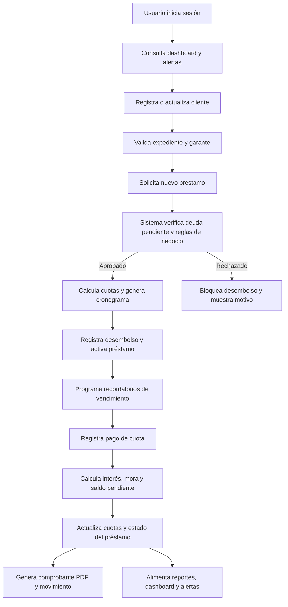

## 1. Descripción del Producto
Sistema web responsivo para administrar clientes, préstamos, cuotas, cobros, mora, reportes y alertas operativas en una financiera o prestamista individual.
- Resuelve el control integral del ciclo de crédito: captación del cliente, evaluación, desembolso, cobranza, seguimiento de mora, reportería y auditoría.
- Aporta valor al negocio al reducir errores manuales, mejorar la trazabilidad de pagos, acelerar la cobranza y ofrecer indicadores ejecutivos en tiempo real.

## 2. Funcionalidades Principales

### 2.1 Roles de Usuario
| Rol | Método de acceso | Permisos principales |
|------|------------------|----------------------|
| Administrador total | Usuario y contraseña creados por el sistema | Configura usuarios, roles, catálogos, clientes, préstamos, pagos, reportes, alertas y auditoría |
| Cobrador | Usuario y contraseña asignados por administrador | Consulta cartera, registra cobros, visualiza clientes asignados, imprime comprobantes y revisa mora |
| Digitador | Usuario y contraseña asignados por administrador | Registra clientes, adjunta información, crea solicitudes o préstamos según permiso, consulta datos sin acceso a configuración sensible |

### 2.2 Módulos Funcionales
1. **Acceso y seguridad**: inicio de sesión, recuperación de acceso, control por roles, permisos y bitácora de actividad.
2. **Dashboard ejecutivo**: KPIs de cartera, tendencias mensuales, tarjetas de acción rápida y alertas de cobro.
3. **Clientes**: listado, alta, edición, baja lógica, fotografía, datos personales, socioeconómicos, geolocalización por dirección y garante.
4. **Préstamos**: creación para clientes existentes, validación de deuda previa, cálculo automático de cuotas, cronograma y estados del crédito.
5. **Cobros y pagos**: registro de pagos, aplicación a cuotas, cálculo de mora, comprobante PDF, saldo en tiempo real y promesas de pago.
6. **Detalle del préstamo**: historial de movimientos, cronograma, pagos, cambios de estado, notas internas y documentos asociados.
7. **Reportes y exportaciones**: reportes de clientes, cartera, mora, cobros, utilidad y producción por período con salida Excel y PDF.
8. **Notificaciones**: avisos por correo y SMS para cuotas próximas a vencer y alertas de mora para administradores.
9. **Administración**: usuarios, roles, parámetros del negocio, plantillas de mensajes, tasas por defecto y productos financieros.

### 2.3 Detalle de Páginas
| Nombre de página | Módulo | Descripción funcional |
|------------------|--------|-----------------------|
| Inicio de sesión | Acceso y seguridad | Autenticación segura, bloqueo por intentos fallidos y recuperación de acceso |
| Dashboard | Indicadores | Muestra monto total prestado, utilidad del mes, utilidad histórica, préstamos vigentes, vencidos y morosos |
| Dashboard | Analítica visual | Gráficos de préstamos otorgados, intereses cobrados, cartera recuperada y tasa de mora mensual |
| Clientes | Listado | Tabla responsive con filtros, fotografía, datos básicos, estado, enlace a Google Maps solo desde la dirección |
| Clientes | Formulario | Captura datos personales, socioeconómicos, laborales y del garante con validaciones estrictas |
| Clientes | Expediente | Consulta historial crediticio, documentos, observaciones, préstamos asociados y trazabilidad |
| Préstamos | Listado | Filtros por estado, cliente, rango de fechas, cobrador y vencimiento |
| Préstamos | Nuevo préstamo | Valida cliente activo, ausencia de deuda vencida o morosa, calcula cuotas y genera calendario automático |
| Préstamos | Detalle | Muestra saldo, cronograma, pagos, mora, historial, comprobantes y acciones permitidas |
| Cobros | Caja de pagos | Permite registrar pago parcial o total, calcular mora automáticamente y actualizar estados |
| Cobros | Comprobante | Genera e imprime recibo PDF con desglose de capital, interés, mora y saldo restante |
| Reportes | Exportación | Permite emitir reportes filtrados y exportar a Excel o PDF |
| Administración | Usuarios y roles | Mantiene usuarios, permisos por módulo y controles de acceso |
| Administración | Configuración | Define productos, tasas por defecto, parámetros de mora, plantillas y recordatorios |

## 3. Flujo Principal del Sistema
El flujo central inicia con la creación del cliente y su garante, continúa con la evaluación y desembolso del préstamo, sigue con la generación automática del cronograma de cuotas y finaliza con la cobranza, actualización de estados, reportería y auditoría. El sistema debe impedir nuevos préstamos a clientes con deuda pendiente en estado vencido o moroso y recalcular automáticamente mora y saldo cuando existan pagos tardíos.

## 4. Diseño de Interfaz
### 4.1 Estilo Visual
- Colores principales: azul petróleo, blanco, gris neutro y acentos ámbar para alertas de mora.
- Estilo de botones: Bootstrap sólido con esquinas medias, estados claros y jerarquía visual por contexto.
- Tipografía: encabezados sobrios de alta legibilidad y cuerpo optimizado para operación intensiva en tablas y formularios.
- Layout: enfoque desktop-first con navegación lateral fija, barra superior contextual, tarjetas KPI y tablas con acciones rápidas.
- Iconografía: Bootstrap Icons o similar, orientada a operaciones financieras, cobranza, alertas y usuarios.

### 4.2 Resumen de Diseño por Página
| Nombre de página | Módulo | Elementos UI |
|------------------|--------|--------------|
| Inicio de sesión | Acceso | Formulario centrado, branding sobrio, mensajes de error claros y foco en seguridad |
| Dashboard | KPIs | Tarjetas resumen, chips de estado, gráficos Chart.js, panel de alertas y accesos rápidos |
| Clientes | Listado | Tabla responsive, buscador, filtros, badges, miniaturas y menú de acciones por fila |
| Clientes | Formulario | Secciones por pestañas o acordeones: personales, socioeconómicos, laborales y garante |
| Préstamos | Nuevo | Wizard o formulario segmentado con simulador de cuotas en tiempo real |
| Préstamos | Detalle | Línea de tiempo de movimientos, tabla de cronograma, resumen financiero y acciones de cobranza |
| Cobros | Registro | Teclado numérico amigable, resumen del préstamo, desglose automático del pago y botón de recibo |
| Reportes | Exportación | Filtros por período, tablas resumidas, KPIs y botones de salida PDF/Excel |
| Administración | Usuarios | Tabla con roles, permisos por módulo y controles de estado |

### 4.3 Responsividad
- Enfoque desktop-first con adaptación progresiva a tablet y móvil.
- Tablas complejas deben degradar a tarjetas o scroll horizontal controlado en pantallas pequeñas.
- Formularios largos deben dividirse en bloques y mantener botones de acción visibles.
- Los gráficos deben redimensionarse sin perder legibilidad y las tarjetas KPI deben reorganizarse por prioridad.
- Los módulos de cobro y consulta rápida deben estar optimizados para uso táctil.

### 4.4 Complementos Funcionales Inspirados en Sistemas Líderes
- Semaforización de cartera por riesgo: vigente, próximo a vencer, vencido y moroso.
- Historial integral de acciones por préstamo y por cliente para trazabilidad completa.
- Bitácora de cambios sensibles en montos, fechas, estados y usuarios operadores.
- Gestión de observaciones de cobranza, promesas de pago y seguimiento del cobrador.
- Parámetros configurables para interés, mora, días de gracia y recordatorios automáticos.
